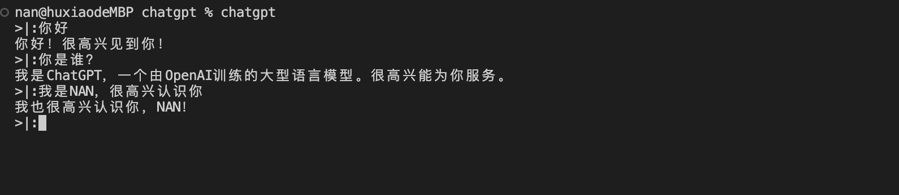

# chatGPT 脚本

## 环境
- node
- npm

## 设置环境变量
在根目录的`config.json`文件中填写你的apiKey，如果没有这个文件请创建它
```json
{
    "OPENAI_API_KEY": "你的apiKey"
}
```

## apiKey 获取方式：
先登陆你的OPENAI账号（你可能需要翻墙，大陆和香港是没有开放的）  
然后访问这个地址[https://platform.openai.com/account/api-keys](https://platform.openai.com/account/api-keys)获取apiKey  
申请的apikey是一次性显示的，请妥善保存，

## 快速安装
在当前目录下运行
```shell
$ npm run install
// 如果报错可能是权限不足
$ sudo npm run install
```
启动
```shell
$ chatgpt
```


## 卸载
```shell
$ npm uninstall chatgpt -g
// 如果报错可能是权限不足
$ sudo npm uninstall chatgpt -g
```
